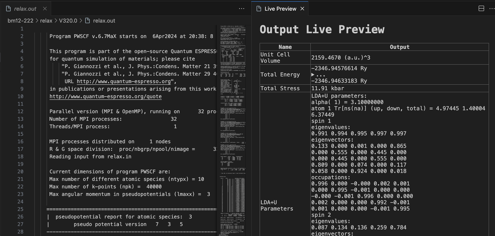

# vscode_quantum_espresso_io_highlight

This is a Visual Studio Code extension that provides syntax highlighting for Quantum Espresso input and output files.

## Features
* [Syntax highlighting](./syntaxes/qe-io.tmLanguage.json) for Quantum Espresso input files.
* [Quantum Espresso Live Preview Extension](./qe-preview//README.md) for Quantum Espresso output files.

## Screenshot 

### Quantum Espresso Live Preview Extension
This extension [Quantum Espresso Live Preview Extension](./qe-preview//README.md) provides a live preview of Quantum Espresso output files and make life easier for Quantum Espresso users.
