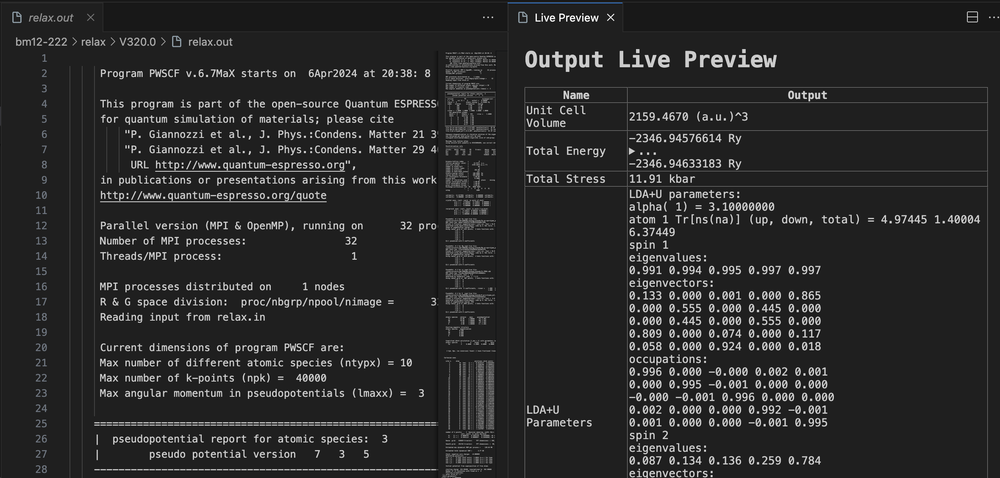

# Quantum Espresso Live Preview Extension

Author by Jingyi Zhuang (@jappoker, [jz2907@columbia.edu](mailto:jz2907@columbia.edu))

This extension provides a live preview feature for Quantum Espresso output files with the extension `.out`. It allows users to view formatted data extracted using regular expressions (regex) defined in a JSON configuration file.

## Installation

To install the extension, follow these steps:

1. Clone or download this repository.
2. Open the project in Visual Studio Code.
3. Press `Ctrl + Shift + B` to build the extension.
4. Press `F5` to open a new window with the extension loaded.
5. Activate the extension using the command palette.

## Usage

Once the extension is installed, you can use it as follows:

1. Open a Quantum Espresso output file (with the `.out` extension) in Visual Studio Code.
2. Press `Ctrl + Shift + P` (Windows/Linux) or `Cmd + Shift + P` (Mac) to open the command palette.
3. Enter `QE: Open Live Preview` to activate the live preview feature.

## Customization

You can customize the regex matching rules by modifying the JSON file located at `/src/regexPatterns.json`. The JSON file should follow this format:

```json
{
    "name": "Name of the Rule",
    "regex": "Regular Expression to Match",
    "renderType": "Type of Rendering (first, last, all)",
    "outputFormat": "Format for Output (with {value} as placeholder)"
}
```

Example:

```json
{
    "name": "Unit Cell Volume",
    "regex": "\\bunit-cell volume\\s+=\\s+([\\d.]+)\\s*\\(a\\.u\\.\\)\\^3",
    "renderType": "last",
    "outputFormat": "{value} (a.u.)^3"
}
```

## Screenshot
